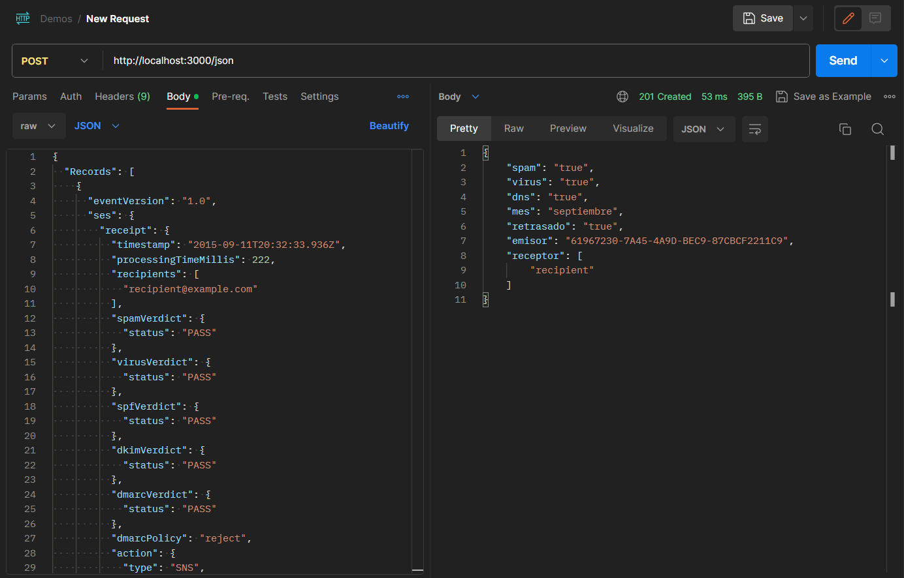

# nestjs-demo
Skill Test - Backend Developer

This is a technical test to evaluate your ability for the position. You can choose either of the two exercises or even do both. We encourage you to send us whatever you have done, even if you don't finish the test. Please use Typescript for the test.  

  

The easy one:

1.  Create a NEST.js project.
2.  Convert [this JSON](https://github.com/aws/aws-lambda-go/blob/main/events/testdata/ses-sns-event.json) into a class.
3.  Use mapper library to map the above JSON to [this structure](https://pastebin.com/bNgAT6Rp).
4.  Create a controller with an endpoint that receives the first JSON and returns the second JSON as a response.  
    

The real challenge:

1.  Create a NEST.js project.
2.  Use mail-parser to parse the content of an [email with attachments](https://support.google.com/mail/answer/9261412?hl=en). A JSON file should be attached.
3.  Create a controller with an endpoint that receives the URL or path of an email file as a parameter.
4.  The response should be the JSON attached in the email in any of the following cases: as a file attachment, inside the body of the email as a link, or inside the body of the email as a link that leads to a webpage where there is a link that leads to the actual JSON.  
    

Instructions:

*   You can choose any challenge; the more difficult it is, the more highly valued the application will be.
*   You have until Friday at midnight to fill out this form with the Github link.
*   Qualified individuals will proceed to the final interview, which will take place next week.

Steps to run:

*   Clone it
*   npm i on root
*   npm run start
*   Go to localhost:3000/json on Postman
*   Send the POST request with the payload as the image below

